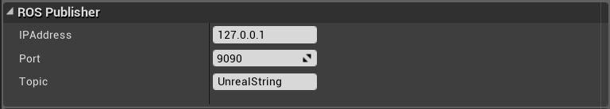
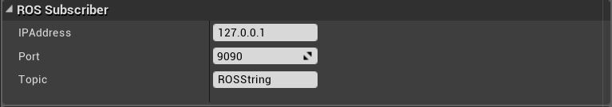

# RobCoG - **Rob**ot **Co**mmonsense **G**ames

Equipping robots with commonsense and naive physics knowledge.

# Example project showcasing various plugins:

* Robot Simulation ([URoboSim](https://github.com/robcog-iai/URoboSim)), See [documentation](Documentation/Documentation.md) for more details.

* TF Publisher ([UTFPublisher](https://github.com/robcog-iai/UTFPublisher))

* ROS Bridge with Unreal Engine ([UROSBridge](https://github.com/robcog-iai/UROSBridge))

# Submodules

 * ```Plugins``` are added as submodules.

```git submodule update --init --recursive```


# Quick Start:


### [URoboSim](https://github.com/robcog-iai/URoboSim)

Drag and drop the pr2 example urdf in the content menu


Drag and drop the the generated file in the world


Generated robot tree


### [UROSBridge](https://github.com/robcog-iai/UROSBridge)

* Install ROS package [rosbridge_suite](http://wiki.ros.org/rosbridge_suite)

* After installation, set up your environment for ROS and rosbridge:

   ```source /opt/ros/<rosdistro>/setup.bash```

* Run the rosbridge to create a [WebSocket](https://www.websocket.org/) on port 9090 by default.

   ```roslaunch rosbridge_server rosbridge_websocket.launch```

* Run the following command to publish a String Message 'Hello World' to a ROS topic.

   ```rostopic pub -r 10 ROSString std_msgs/String "Hello World"```

* Add  ```ROSStringPublisher``` and ```ROSStringSubscriber``` actors to your level/world

* Set your ROS bridge IP and PORT:




#### Service calls

* Add the `ROSAddTwoIntsServiceClient` or `ROSAddTwoIntsServiceServer` actors to the World

* Setup your IP and PORT as mentioned in the above steps

* In ROS add the [ros_tutorials](https://github.com/ros/ros_tutorials) package to your workspace:

``` git clone https://github.com/ros/ros_tutorials.git ```

* For `ROSAddTwoIntsServiceClient`:

``` $ rosrun rospy_tutorials add_two_ints_server ```

* For `ROSAddTwoIntsServiceServer`:

``` $ rosrun rospy_tutorials add_two_ints_client 11 22 ```


### [UTFPublisher](https://github.com/robcog-iai/UTFPublisher)


### Engine Version 4.19
